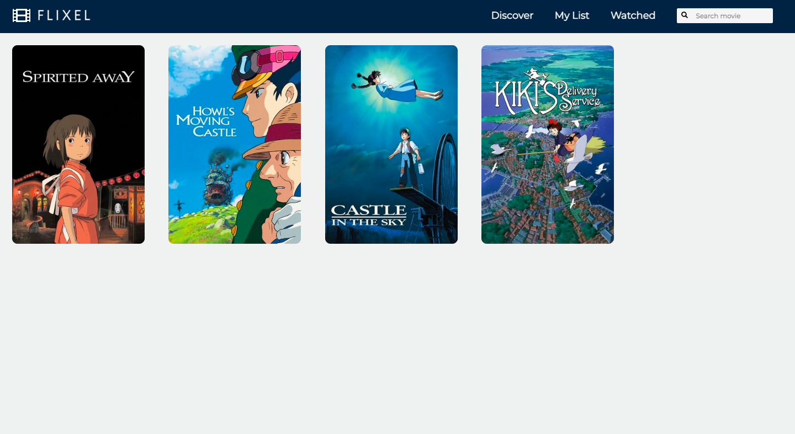
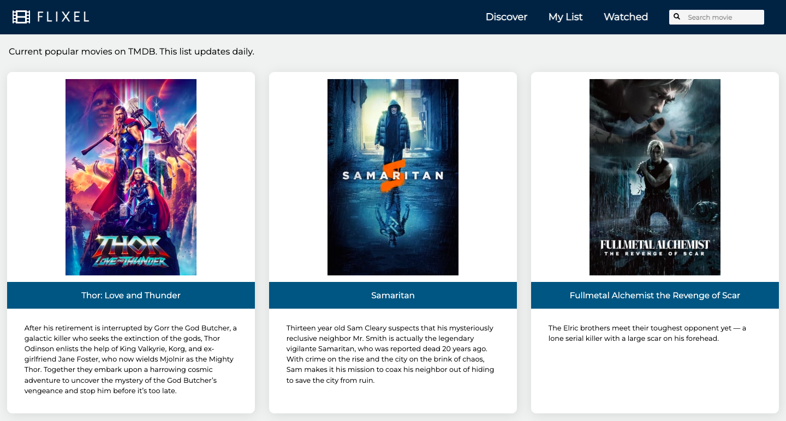
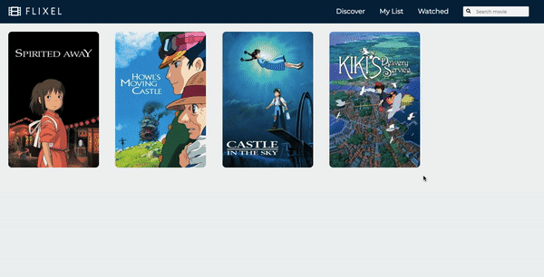
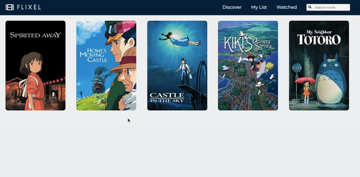
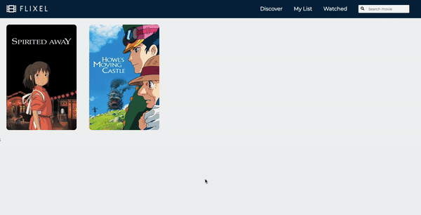

# Flixel

A movie application that allows users to search for and save movies to a watchlist. Users can also visit the discover page which updates daily and displays current popular movies.

# Features

- Client-side search
- Fetches list of movies from The Movie Database (TMDB) API
- Utilizes localStorage to save data to browser
- Marks movies as watched or not yet watched

### Home/My List Page

### Discover Page

# Demo

### Add Movie to List

### Add Movie to Watched

### Add/Edit Rating

### Tech Stack

- HTML
- CSS
- Javascript
- React
- React Hooks

Feel free to check it out using the link below!
[https://flixel.netlify.app/](https://flixel.netlify.app/)
